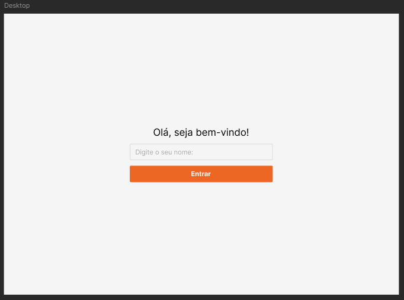

<h1 align="center" style="font-weight: bold;">System CRUD - Users 💻</h1>

<p align="center">
 <a href="#tech">Technologies</a> • 
 <a href="#started">Getting Started</a> • 
  <a href="#colab">Collaborator(s)</a> •
 <a href="#contribute">Contribute</a>
</p>

<p align="center">
    <b>A complete system with inicial screen where it can insert your name and will redirect to other screen with all registered clients, where you can make a new register, select, update and delete this clients. A screen that you can view all the selected clients!</b>
</p>

<p align="center">
     <a href="https://sist-cadas-usuarios-react.vercel.app/"> Visit this Project</a>
</p>

<h2 id="layout">🎨 Layout</h2>

<p align="center">
    
</p>

<h2 id="technologies">💻 Technologies</h2>

- React
- TypeScript
- Node.js
- Tailwind CSS
- React Icons
- ResponsivelyApp

<h2 id="started">🚀 Getting started</h2>

To run this project in your computer, you should installing some programs before:

<h3>Pre-requisites</h3>

Here you list all pre-requisites and links necessary for running this project. For example:

- [NodeJS](https://nodejs.org/en/download/)
- [Git 2](https://git-scm.com/downloads)

<h3>Cloning</h3>

To clone this project, you can copy the command below and paste in your terminal or GitBash at the local that you want:

```bash
git clone your-project-url-in-github
```

<h3>Starting</h3>

How to start your project

```bash
cd project-name
npm some-command-to-run
```

<h2 id="routes">📍 Application Routes</h2>

Here you can list the main routes of your API, and what are their expected request bodies.
​
| route               | description                                          
|----------------------|-----------------------------------------------------
| <kbd>/authenticate</kbd>     | page that list all user info
| <kbd>/login</kbd>     | page to login
| <kbd>/dashboard</kbd>     | page that contains all user shopping and spences info

<h2 id="colab">🤝 Collaborators</h2>

Special thank you for be here in this project.

<table>
  <tr>
    <td align="center">
      <a href="#">
        <br>
        <sub>
          <b>Hallysson Mateus</b>
        </sub>
      </a>
    </td>
  </tr>
</table>

<h2 id="contribute">📫 Contribute</h2>

Here you will explain how other developers can contribute to your project. For example, explaining how can create their branches, which patterns to follow and how to open an pull request

1. `git clone https://github.com/Fernanda-Kipper/text-editor.git`
2. `git checkout -b feature/NAME`
3. Follow commit patterns
4. Open a Pull Request explaining the problem solved or feature made, if exists, append screenshot of visual modifications and wait for the review!

<h3>Documentations that might help</h3>

[📝 How to create a Pull Request](https://www.atlassian.com/br/git/tutorials/making-a-pull-request)

[💾 Commit pattern](https://gist.github.com/joshbuchea/6f47e86d2510bce28f8e7f42ae84c716)